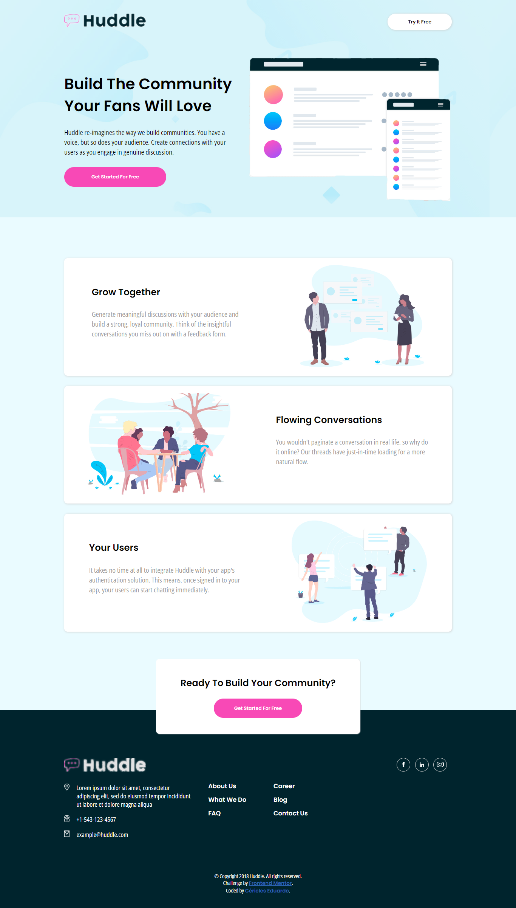
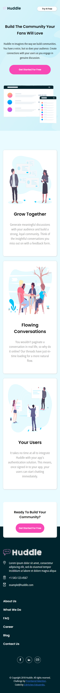

<h1 align="center" style="font-weight: bold;">Huddle Landing Page Challenge 💻</h1>

<p align="center">
    <b>A landing page challenge recreated by Eduardo Portugal</b>
</p>


<h2 id="layout">🎨 Layout</h2>

<p align="center">
    
    
</p>

<h2 id="technologies">💻 Technologies</h2>

- Html5
- Css3
- Gimp

<h2>Cloning</h2>

How to clone this project

```bash
git clone https://github.com/Eduardo-Portugal/challenge1-huddle-landing-page
```

<h2 id="started">🚀 Getting started</h2>

- After cloning this project, just open the <strong>index.html</strong> file in a browser of your choice.

- or If you want more details, open the project folder in a code editor of your choice.

<h3>Prerequisites</h3>

- A browser of your choice
- A code editor (optional)

<h3>Documentations that might help</h3>

[📝 How to create a Pull Request](https://www.atlassian.com/br/git/tutorials/making-a-pull-request)

[💾 Commit pattern](https://gist.github.com/joshbuchea/6f47e86d2510bce28f8e7f42ae84c716)
